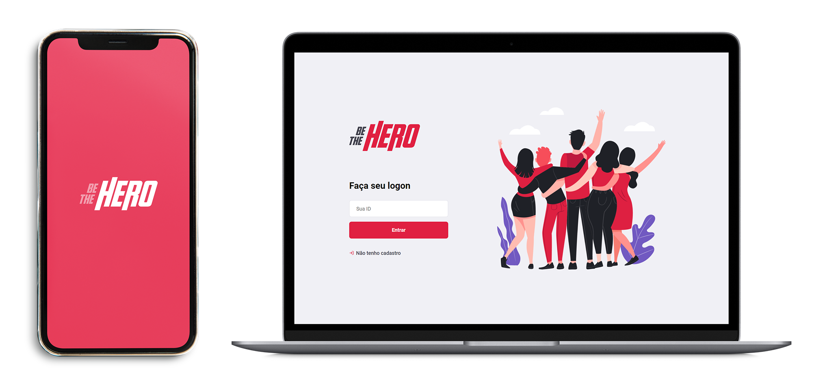

<h1 align="center">
    
</h1>

  

## Projeto

Desenvolvido junto com a [Rocketseat](https://rocketseat.com.br/) esperando entender mais como funciona a stack React, React Native e Node. 
O projeto consiste na criação de um sistema que conecta pessoas que desejam fazer contribuições a ONG's que necessitam de ajuda financeira para continuar existindo.

## Tecnologias

Esse projeto foi desenvolvido com as seguintes tecnologias:

- [Node.js](https://nodejs.org/en/)
- [React](https://reactjs.org)
- [React Native](https://facebook.github.io/react-native/)
- [Expo](https://expo.io/)
